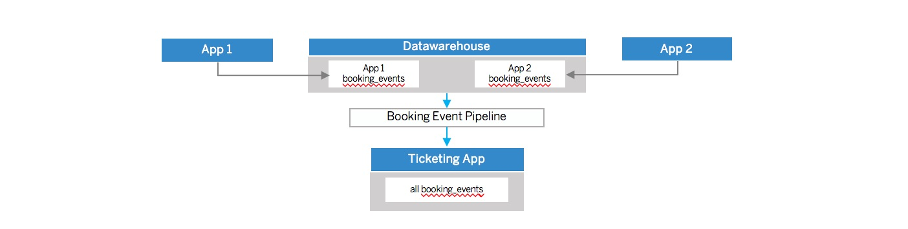
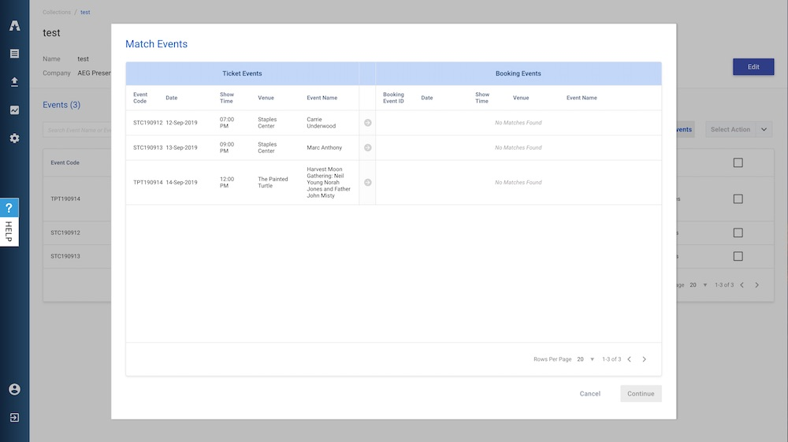

<p align="center">
  
</p>

<h3 align="center">Bijan's Portfolio</h3>

<p align="center">
  Hello world, thanks for stoping by my personal Github.
  <br>
  Below you'll find background on myself and the projects I have worked on over the years.
</p>

## Table of Contents 

- [AEG](#aeg)
- [EY](#ey)
- [NFL](#nfl)

## AEG: Ticketing Application
AEG is one of the largest companies in the live entertainment industry, they book shows at venues and generate revenue from ticket sales. 

The objectives of the AEG Ticketing Application are to first ingest ticket sale data from 3rd parties then associate it with events created in external booking applications.

Below are several features which I enjoyed implementating for this application

#### Ticket Sales ETL 

Everytime tickets are sold for an AEG show raw ticket sale data from 3rd parties is sent to AEG's datawarehouse.

The raw data is then available for the Ticketing Application to ingest, upon import the raw data is transformed to the intermediate ```ticket_feed_wrap``` table.

The ```ticket_feed_wrap``` tables are then transformed and split into their target tables ```ticket_events``` and ```daily_counts```. 

I was responsible for defining the tables required at each step of the transformation, along with testing the outcome of the Ticket Sales ETL. 

See documentation below for details: 

[Ticketing ETL Product Requirements](https://github.com/bayrami1/work-experience-/blob/master/AEG%20Project/ETL%20Product%20Requirements%20.pdf)

#### Matching Ticket Events to Events in different applications
Everytime a ticket sale is imported into the Ticketing App backend a new ```ticket_events``` and ```daily_counts``` objects are created, these tables represent the ticket sales associated with a given show or ```booking_events``` created in AEGs booking applications.   

The second objective of the Ticketing Application is too associate ```ticket_events``` with ```booking_events```, for reporting and forecasting. 



The first step required standardizing the raw ```booking_events``` created in other systems and then importing them from a datawarehouse into our backend. 



The second step required creating an intuitive workflow that would allow users to easily make the association between Ticket Events and Booking Events (NOTE: there are no recommended booking events for the given ticket events in the screenshot above because we were using test data) 

Successfully delivering this feauture required working closely with engineering, UX, and business teams. Collaborating with a  cross-functional team to deliver a complex feature is what made shipping this feature so fulfulling. 

See documentation below for more details: 

[Booking Events Import](https://github.com/bayrami1/work-experience-/blob/master/AEG%20Project/TA%20_%20booking_events%20creation%20.pdf)

#### Access Control and Privacy Settings
Defining the roles for this application took extensive user interviews, there was only one role in the last application they used and this led to major issues between business units. 

I added a ticketer role, and groups which limited the events users had access too which greatly reduced the amount of friction between business units. 

The documentation below outlines the roles and respective priviliges, and the list groups used. The appendix also includes outlines for the user stories required to implement the roles and privacy settings:

[Access Control and Privacy Settings](https://github.com/bayrami1/work-experience-/blob/master/AEG%20Project/TA%20_%20Access%20Control%20and%20Privacy%20Settings.pdf)

## EY
#### Storage Manager and Tax Application

EY needed a secure way to manage their sensitive tax data, and they needad an exposed API from this datawarehouse to read data into the Tax Application which was used to process the data. Additionally, this implementation had to be cloud provider agnostic so we had could not rely on and specific managed service. 

My team was responsible for building both the Storage Manager a datawarehouse that relied on a key management system to create access tokens and the Tax application which integrated with the storage manager and processed the data to automate work that was previously done manually. 

The delivery of the Storage Manager and the automated jobs ran through the Tax Application allowed the Tax team to increase efficiency of their team by 25%

Due to the proprietary data for this project I am unable to share documentation or architecture relating to the project. 

## NFL 
#### Fantasy Football Data Analysis Project

When I was a senior at UCLA the NFL hired me as a Product Manager to investigate their NFL Fantasy Football user data. 

The objective of our project was to find trends in Fantasy Football data to increase the retention rate of NFL Fantasy Football users.

My team of data scientists used SQL to structure over four million observations, then used R to create linear models that predicted play time of NFL Fantasy Football users.

Due to the proprietary data for this project I am unable to share documentation or architecture relating to the project. 
