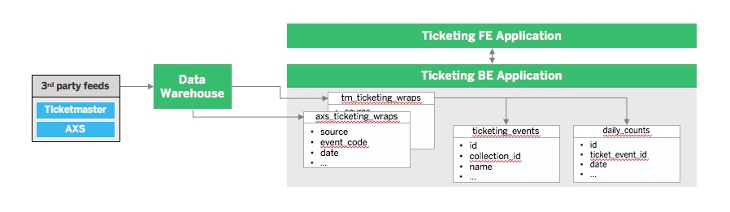

  

<h3 align="center">Bijan's Portfolio</h3>

  Hello world, thanks for stoping by my personal Github.
   
  Below you'll find background on myself and the projects I have worked on over the years.

## Table of Contents 

- [AEG](#aeg)
- [EY](#ey)
- [NFL](#nfl)

## AEG: Ticketing Application
Objective of the ticketing application is to import and consolidate ticket inventory data from 3rd parties and map it to specific events created in external applications used at AEG.

#### Ticketing ETL 

Raw ticket feeds from 3rd parties are first imported into AEG's datawarehouse for historical purposes.

Upon import they are transformed from the ticket_feed_raw format to the intermediate ticket_feed_wrap table which is saved on the Ticketing Applications BE 

The ticket_feed_wrap tables are then transformed once again and split into their final tables the ticket_events and daily_counts tables

I was responsible for defining the tables required at each step of the transformation, along with testing the outcome of the ETL. For a step by step description of this process please refer to documentation below: 

[Ticketing ETL Product Requirements](https://github.com/bayrami1/work-experience-/blob/master/AEG%20Project/ETL%20Product%20Requirements%20.pdf)

#### Architecture 

#### Notifications

### EY
#### Storage Manager 
Due to the proprietary data for this project I am unable to share documentation or architecture relating to the project 
- created SM, which was created to manage very sensitive Tax data 
- accomplished using a proprietary cloud agnostic architecture using multiple services 
- created the Tax application which used tokens generated by the storage manager to access sensitive data and automate tax pipelines which were done manually in the past
- the creation of the storage manager and the automated pipelines ran through the tax application allowed the Tax team to increase efficiency of their team by 25%

### NFL 
#### Fantasy Football Data Analysis Project
